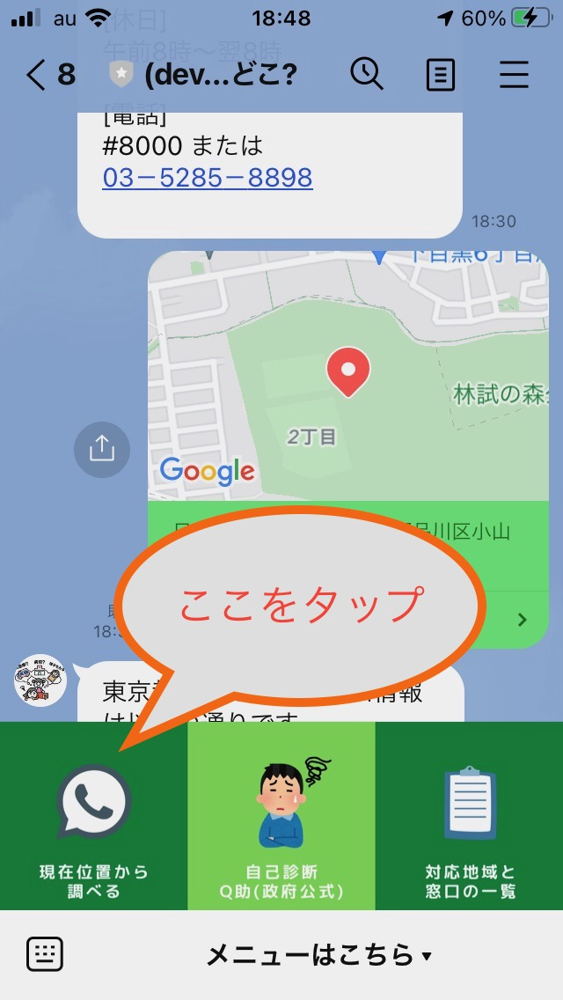
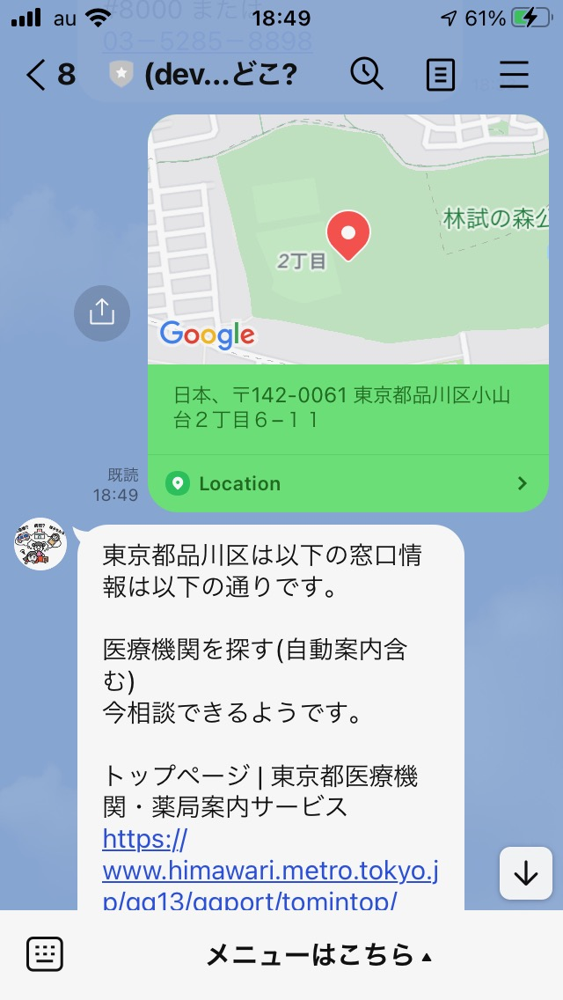
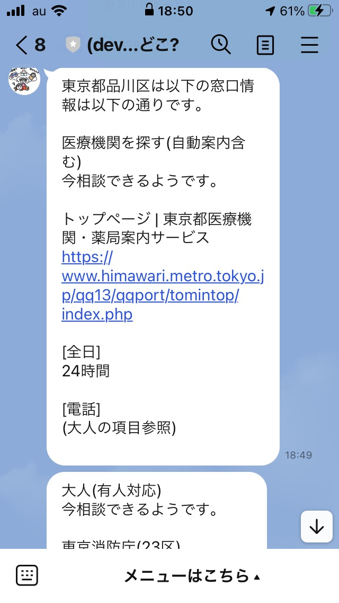

# (非公式 LINEボット)救急相談どこ?

**救急車を呼ぶかどうか迷った時**
どこに電話すれば良いか
あなたはすぐに答えられますか?

答えは `大人 #7119` `小児 #8000` ですが、、、

## #7119は全国対応ではありません!

また、#8000は全国対応ですが、**受付時間がバラバラ**です。

そんなわけで、現在位置から相談窓口を返してくれるLINEボットを作りました。

日常生活で、お出かけ先で、いざという時慌てないためにも
ぜひお友達になってください。

# 使い方

1. LINEアカウントと友達になる

[友達になる](https://lin.ee/OFEWWPM) 

2. リッチメニューの一番左のボタンをタップします。 

 

3. 現在位置が表示されるので、右上の送信ボタンを押します。

(調べたい地域がある場合は、地図を移動させてください)
 

4. 救急相談(大人・小児)と医療機関案内が表示されます。

   

5. 自己診断してみる

リッチメニュー真ん中のボタンをタップすると、消防庁公式の自己診断サイト[Q助](http://www.fdma.go.jp/neuter/topics/filedList9_6/kyukyu_app/kyukyu_app_web/index.html)にアクセスできます。

# 相談窓口一覧 (2021/10/09更新)

正確な情報を探しています。
お気づきの点があれば [twitter](https://twitter.com/purejapaneseonl)まで情報をお寄せください。

- ナビサイト・自動案内・有人対応を分けてまとめたい
- 青森県(大人の電話番号が不確か)
- 山形県(どれが最新の情報か不明)
- 神奈川県の相模原メディカルセンター(対応地域が不明)
- 群馬・山梨・愛知・岐阜・佐賀の救急病院など案内は順次追加予定

## 医療機関を探す(自動案内含む)

都道府県|市区町村|WEB|平日|土曜|日祝|電話
---|---|---|---|---|---|---
北海道||[LINK](https://www.qq.pref.hokkaido.jp/qq/qq01.asp)|24時間|24時間|24時間|0120-20-8699 011-221-8699
青森道||[LINK](https://www.qq.pref.aomori.jp/)|24時間|24時間|24時間|0120-733620
岩手県||[LINK](http://www.med-info.pref.iwate.jp/)|24時間|24時間|24時間|HPのみ
宮城県||[LINK](http://medinf.mmic.or.jp/)|24時間|24時間|24時間|HPのみ
秋田県||[LINK](http://www.qq.pref.akita.lg.jp/qq05/WP0101/RP010101BL.do;jsessionid=1A22E05A8C7F68094742FC475C6B6628)|24時間|24時間|24時間|HPのみ
山形県||[LINK](https://www.pref.yamagata.jp/medical-net/)|24時間|24時間|24時間|HPのみ
福島県||[LINK](http://www.ftmis.pref.fukushima.lg.jp/ap/qq/men/pwtpmenult01.aspx)|24時間|24時間|24時間|0120-963-990
東京都||[LINK](https://www.himawari.metro.tokyo.jp/qq13/qqport/tomintop/index.php)|24時間|24時間|24時間|(大人の項目参照)
神奈川県||[LINK](https://www.city.sagamihara.kanagawa.jp/kurashi/kyubyo/1008444/index.html)|午後5時から翌9時|午後1時から翌9時|午前9時から翌9時|042-756-9000
群馬県||[LINK](https://www.med.pref.gunma.jp/pb_md_telfax/)|24時間|24時間|24時間|(リンク先を参照)
山梨県||[LINK](https://www.yamanashi-iryo.net/qq19/QQ19TPMNLT/information.jsp)|24時間|24時間|24時間|(リンク先を参照)
長野県||[LINK](https://www.qq.pref.nagano.lg.jp/pb_top/pb_service_guide)|24時間|24時間|24時間|050-3033-0665
富山県||[LINK](https://www.qq.pref.toyama.jp/qq16/qqport/kenmintop/)|24時間|24時間|24時間|(HPのみ)
石川県||[LINK](http://i-search.pref.ishikawa.jp/)|24時間|24時間|24時間|(HPのみ)
福井県||[LINK](http://www.qq.pref.fukui.jp/qq18/qqport/kenmintop)|24時間|24時間|24時間|0120-987-199
岐阜県||[LINK](https://www.qq.pref.gifu.lg.jp/qq21/WP0101/RP010101BL)|24時間|24時間|24時間|(大人の項目参照)
静岡県||[LINK](https://www.qq.pref.shizuoka.jp/qq22/qqport/kenmintop/)|24時間|24時間|24時間|0800-222-1199
京都府||[LINK](http://www.mfis.pref.kyoto.lg.jp/ap/qq/men/pwtpmenult01.aspx)|24時間|24時間|24時間|075-694-5499
滋賀県||[LINK](http://www.shiga.iryo-navi.jp/qqport/kenmintop/)|24時間|24時間|24時間|(HPのみ?)
大阪府||[LINK](https://www.mfis.pref.osaka.jp/apqq/qq/men/pwtpmenult01.aspx)|24時間|24時間|24時間|06-6693-1199
奈良県||[LINK](https://www.qq.pref.nara.jp/qq29/qqport/kenmintop/)|24時間|24時間|24時間|(大人の項目参照)
鳥取県||[LINK](https://medinfo.pref.tottori.lg.jp/)|24時間|24時間|24時間|(大人の項目参照)
岡山県||[LINK](https://www.qq.pref.okayama.jp/qq33/qqport/kenmintop/)|24時間|24時間|24時間|(HPのみ)
広島県||[LINK](http://www.qq.pref.hiroshima.jp/qq34/qqport/kenmintop/)|24時間|24時間|24時間|(大人の項目参照)
山口県||[LINK](https://www.qq.pref.yamaguchi.lg.jp/qq35/WP000/RP000001BL.do)|24時間|24時間|24時間|(大人の項目参照)
愛媛県||[LINK](https://www.qq.pref.ehime.jp/qq38/qqport/kenmintop/)|24時間|24時間|24時間|0120-962-119
高知県||[LINK](https://www.kochi-iryo.net/)|24時間|24時間|24時間|(大人の項目参照)
福岡県||[LINK](http://www.fmc.fukuoka.med.or.jp/qq/qq40gnmenult.asp)|24時間|24時間|24時間|092-415-3113
佐賀県||[LINK](https://www.qq.pref.saga.jp/)|24時間|24時間|24時間|(大人の項目参照)
長崎県||[LINK](http://iryou.pref.nagasaki.jp/)|24時間|24時間|24時間|(HPのみ)
熊本県||[LINK](http://mis.kumamoto.med.or.jp/)|24時間|24時間|24時間|(HPのみ)
大分県||[LINK](https://iryo-joho.pref.oita.jp/)|24時間|24時間|24時間|(HPのみ)
宮崎県||[LINK](http://www.e-navi.pref.miyazaki.lg.jp/)|24時間|24時間|24時間|(HPのみ)
鹿児島県||[LINK](http://iryo-info.pref.kagoshima.jp/qqport/)|24時間|24時間|24時間|(HPのみ)
沖縄県||[LINK](http://imuutina.pref.okinawa.lg.jp/)|24時間|24時間|24時間|(HPのみ)

## 大人(有人対応)

都道府県|市区町村|WEB|平日|土曜|日祝|電話
---|---|---|---|---|---|---
北海道|札幌市 石狩市 新篠津村 栗山町 当別町 南幌町|[LINK](https://www.city.sapporo.jp/hokenjo/qq7199/naiyou.html)|24時間|24時間|24時間|#7119 011-272-7119
青森県||[LINK](https://www.qq.pref.aomori.jp/)|24時間|24時間|24時間|0120-733620
宮城県||[LINK](https://www.pref.miyagi.jp/soshiki/iryou/kyuukyuutel.html)|午後7時から翌8時|午後2時から翌8時|午前8時から翌8時|#7119 022-706-7119
山形県||[LINK](https://www.pref.yamagata.jp/090013/bosai/shobo/kyuukyuu/99tel.html)|午後7時から翌8時|午後7時から翌8時|午後7時から翌8時|#8500 023-633-0799
東京都|千代田区 中央区 港区 新宿区 文京区 台東区 墨田区 江東区 品川区 目黒区 大田区 世田谷区 渋谷区 中野区 杉並区 豊島区 北区 荒川区 板橋区 練馬区 足立区 葛飾区 江戸川区|[LINK](https://www.tfd.metro.tokyo.lg.jp/lfe/kyuu-adv/soudan-center.htm)|24時間|24時間|24時間|#7119 03-3212-2323
東京都||[LINK](https://www.tfd.metro.tokyo.lg.jp/lfe/kyuu-adv/soudan-center.htm)|24時間|24時間|24時間|#7119 042-521-2323
神奈川都|横浜市|[LINK](https://www.yokohama-emc.jp/pc/syouni/syouni.html)|24時間|24時間|24時間|#7119 045-232-7119
神奈川都|川崎市|[LINK](http://www.kawasaki.kanagawa.med.or.jp/emergency/center)|24時間|24時間|24時間|044-739-1919
埼玉県||[LINK](https://99.pref.saitama.lg.jp/)|24時間|24時間|24時間|#7119 048-824-4199
茨城県||[LINK](http://www.qq.pref.ibaraki.jp/?)|24時間|24時間|24時間|#7119 050-5445-2856
千葉県||[LINK](http://www.qq.pref.chiba.lg.jp/)|24時間|24時間|24時間|#7009  03-6735-8305
栃木県||[LINK](https://www.pref.tochigi.lg.jp/e02/welfare/iryou/kyuukyuu/kyukyudenwasoudan.html)|午後6時から午後10時|午後4時から午後10時|午後4時から午後10時|#7111 028-623-3344
新潟県||[LINK](https://www.pref.niigata.lg.jp/sec/chiikiiryo/1356882439151.html)|24時間|24時間|24時間|#7119 025－284－7119
愛知県||[LINK](http://www.qq.pref.aichi.jp/es/qq/qq23tpdi_lt.asp)|24時間|24時間|24時間|(リンク先を参照)
岐阜県||[LINK](https://www.qq.pref.gifu.lg.jp/qq21/WP0003/RP000301BL)|24時間|24時間|24時間|(リンク先を参照)
三重県||[LINK](https://www.qq.pref.mie.lg.jp/qq24/qqport/kenmintop/)|24時間|24時間|24時間|059-229-1199
京都府||[LINK](http://www.pref.kyoto.jp/iryo/7119.html)|24時間|24時間|24時間|#7119 0570-00-7119
大阪府||[LINK](https://www.city.osaka.lg.jp/shobo/page/0000052526.html)|24時間|24時間|24時間|#7119 06-6582-7119
兵庫県|神戸市|[LINK](https://www.city.kobe.lg.jp/a65055/bosai/kyukyuiryo/telephone.html)|24時間|24時間|24時間|#7119 078-331-7119
奈良県||[LINK](https://www.pref.nara.jp/53886.htm)|24時間|24時間|24時間|#7119 0744-20-0119
和歌山県|田辺市|[LINK](http://www.city.tanabe.lg.jp/shoubo/gyouji/kinnkyuudohanntei.html)|24時間|24時間|24時間|#7119 0739-22-0119
和歌山県||[LINK](https://www.wakayama.qq-net.jp/qq30/WP0101/RP010101BL.do)|24時間|24時間|24時間|073-426-1199
鳥取県||[LINK](https://www.pref.tottori.lg.jp/279398.htm)|午後7時から翌8時|午前8時から翌8時|午前8時から翌8時|#7111 03-6667-3372
広島県|広島市 呉市 竹原市 大竹市 東広島市 廿日市市 安芸高田市 江田島市 府中町 海田町 熊野町 坂町 安芸太田町 北広島町|[LINK](https://www.city.hiroshima.lg.jp/site/holidaymedicalcare/14659.html)|24時間|24時間|24時間|#7119 082-246-2000
山口県|岩国市 和木町|[LINK](https://www.city.hiroshima.lg.jp/site/holidaymedicalcare/14659.html)|24時間|24時間|24時間|#7119 082-246-2000
山口県|下関市 宇部市 山口市 防府市 下松市 光市 長門市 柳井市 美祢市 周南市 山陽小野田市 周防大島町 上関町 田布施町 平生町|[LINK](https://www.pref.yamaguchi.lg.jp/cms/a11600/7119/201906200001.html)|24時間|24時間|24時間|#7119 083-921-7119
山口県|萩市 阿武町|[LINK](https://www.city.hagi.lg.jp/soshiki/41/h33662.html)|24時間|24時間|24時間|0120-506-322
徳島県||[LINK](https://anshin.pref.tokushima.jp/med/docs/2019111900060/)|午後6時から翌8時|午前8時から翌8時|午前8時から翌8時|#7111 088-622-6530
高知県||[LINK](https://www.kochi-iryo.net/)|24時間|24時間|24時間|088-825-1299
福岡県||[LINK](http://www.fmc.fukuoka.med.or.jp/t7119/index.html)|24時間|24時間|24時間|#7119 092-471-0099
佐賀県||[LINK](https://www.qq.pref.saga.jp/pb_top/top_medical_interrogating)|24時間|24時間|24時間|(リンク先参照)

## 小児(有人対応)

都道府県|市区町村|WEB|平日|土曜|日祝|電話
---|---|---|---|---|---|---
北海道||[LINK](https://www.qq.pref.hokkaido.jp/qq/qq01.asp)|24時間|24時間|24時間|#8000 011-232-1599
青森県||[LINK](https://www.pref.aomori.lg.jp/soshiki/kenko/iryo/kodomoqq.html)|午後6時から翌8時|午後1時から翌8時|午前8時から翌8時|#8000 017－722－1152
岩手県||[LINK](http://kodomo-qq.jp/index.php?pname=n8000%2Fp3)|午後7時から午後11時|午後7時から午後11時|午後7時から午後11時|#8000 019-605-9000
秋田県||[LINK](https://www.pref.akita.lg.jp/pages/archive/2319)|午後7時から翌8時|午後7時から翌8時|午後7時から翌8時|#8000 018-895-9900
宮城県||[LINK](https://www.pref.miyagi.jp/soshiki/iryou/shouni04.html)|午後7時から翌8時|午後7時から翌8時|午後7時から翌8時|#8000 022-212-9390
山形県||[LINK](https://www.pref.yamagata.jp/090013/bosai/shobo/kyuukyuu/99tel.html)|午後7時から翌8時|午後7時から翌8時|午後7時から翌8時|#8000 023-633-0299
福島県||[LINK](http://www.pref.fukushima.lg.jp/sec/21045c/iryou-kodomokyukyu.html)|午後7時から翌8時|午後7時から翌8時|午後7時から翌8時|#8000 024-521-3790
東京都||[LINK](https://www.fukushihoken.metro.tokyo.lg.jp/kodomo/sodan/k_soudan.html)|午後6時から翌8時|午前8時から翌8時|午前8時から翌8時|#8000 03－5285－8898
神奈川県||[LINK](http://www.pref.kanagawa.jp/docs/t3u/cnt/f952/)|午後7時から翌8時|午後7時から翌8時|午後7時から翌8時|#8000 045-722-8000
埼玉県||[LINK](https://www.pref.saitama.lg.jp/a0703/20151214.html)|24時間|24時間|24時間|#8000 048-833-7911
千葉県||[LINK](http://www.pref.chiba.lg.jp/iryou/soudan/shouni.html)|午後7時から翌6時|午後7時から翌6時|午後7時から翌6時|#8000 043-242-9939
茨城県||[LINK](http://www.qq.pref.ibaraki.jp/?)|24時間|24時間|24時間|#8000 050-5445-2856
栃木県||[LINK](http://www.pref.tochigi.lg.jp/e02/advice/fukushi/iryou/totigikodomokyuukyuudennwasoudan.html)|午後6時から翌8時|午後6時から翌8時|午前8時から翌8時|#8000 028-600-0099
群馬県||[LINK](https://www.pref.gunma.jp/02/d1010002.html)|午後6時から翌8時|午後6時から翌8時|午前8時から翌8時|#8000 03-6735-8835
新潟県||[LINK](https://www.pref.niigata.lg.jp/sec/chiikiiryo/1196180205728.html)|午後7時から翌8時|午後7時から翌8時|午後7時から翌8時|#8000 025－288－2525
富山県||[LINK](https://www.pref.toyama.jp/1204/kurashi/soudanshisetsu/madoguchi/kenkouiryou/kj00018760.html)|午後7時から翌9時|午後1時から翌9時|午前9時から翌9時|#8000 076-444-1099
石川県||[LINK](https://www.pref.ishikawa.lg.jp/iryou/support/qqtel/index.html)|午後6時から翌8時|午後6時から翌8時|午後6時から翌8時|#8000 076-238-0099
福井県||[LINK](https://www.pref.fukui.lg.jp/doc/iryou/iryoujouhou/8000.html)|午後7時から翌9時|午後7時から翌9時|午前9時から翌9時|#8000 0776-25-9955
長野県||[LINK](https://www.pref.nagano.lg.jp/hoken-shippei/sodan/shonikyukyu.html)|午後7時から翌8時|午後7時から翌8時|午後7時から翌8時|#8000 0263-34-8000
山梨県||[LINK](https://www.pref.yamanashi.jp/imuka/shonikyukyu.html)|午後7時から翌7時|午後3時から翌7時|午前9時から翌7時|#8000 0776-25-9955
静岡県||[LINK](http://www.pref.shizuoka.jp/kousei/ko-450/iryou/kodomokyuukyuudenwa.html)|午後6時から翌8時|午後1時から翌8時|午前8時から翌8時|#8000 054-247-9910
愛知県||[LINK](https://www.pref.aichi.jp/kosodate/hagumin/emergency/index.html)|午後7時から翌8時|午後7時から翌8時|午後7時から翌8時|#8000 052-962-9900
岐阜県||[LINK](http://www.qq.pref.gifu.lg.jp/qq21/WP0101/RP010101BL)|午後6時から翌8時|午前8時から翌8時|午前8時から翌8時|#8000 058-240-4199
三重県||[LINK](https://www.pref.mie.lg.jp/CHIIRYO/HP/2015030111.htm)|午後7時から翌8時|午後7時から翌8時|午後7時から翌8時|#8000 059-232-9955
滋賀県||[LINK](http://www.shiga.iryo-navi.jp/qqport/kenmintop/other/fks020.php)|午後6時から翌8時|午後6時から翌8時|午前9時から翌8時|#8000 077-524-7856
京都府||[LINK](http://www.pref.kyoto.jp/iryo/8000.html)|午後7時から翌8時|午後3時から翌8時|午後7時から翌8時|#8000 075-661-5596
大阪府||[LINK](https://www.pref.osaka.lg.jp/iryo/syouni-qq/syouni_qq_tel.html)|午後7時から翌8時|午後7時から翌8時|午後7時から翌8時|#8000 06-6765-3650
兵庫県||[LINK](http://web.pref.hyogo.lg.jp/kf15/hw11_000000013.html)|午後6時から翌8時|午後6時から翌8時|午前8時から翌8時|#8000 078-304-8899
奈良県||[LINK](https://www.pref.nara.jp/item/15976.htm)|午後6時から翌8時|午後1時から翌8時|午前8時から翌8時|#8000 0742-20-8119
和歌山県||[LINK](https://www.pref.wakayama.lg.jp/prefg/050100/kodomodial/kodomokyukyu.html)|午後7時から翌9時|午前9時から翌9時|午前9時から翌9時|#8000 073-431-8000
鳥取県||[LINK](https://www.pref.tottori.lg.jp/dd.aspx?menuid=97931)|午後7時から翌8時|午前8時から翌8時|午前8時から翌8時|#8000 03-6626-220
島根県||[LINK](https://www.pref.shimane.lg.jp/medical/kenko/iryo/shimaneno_iryo/8000/)|午後7時から翌9時|午前9時から翌9時|午前9時から翌9時|#8000 03-3478-1060
岡山県||[LINK](https://www.pref.okayama.jp/page/detail-7000.html)|午後7時から翌8時|午後6時から翌8時|午後6時から翌8時|#8000 086-801-0018
広島県||[LINK](https://www.pref.hiroshima.lg.jp/soshiki/54/syouniqqdenwa.html)|午後7時から翌8時|午後7時から翌8時|午後7時から翌8時|#8000 082-505-1399
山口県||[LINK](https://www.pref.yamaguchi.lg.jp/cms/a11700/shounikyuukyuu/201503250001.html)|午後7時から翌8時|午後7時から翌8時|午後7時から翌8時|#8000 083-921-2755
徳島県||[LINK](https://www.pref.tokushima.lg.jp/ippannokata/kenko/iryo/2012092100146/)|午後6時から翌8時|午後6時から翌8時|午後6時から翌8時|#8000 088-621-2365
香川県||[LINK](https://www.qq.pref.kagawa.lg.jp/ir37/qqport/kenmintop/other/fks510.php)|午後6時から翌8時|午後6時から翌8時|午後6時から翌8時|#8000 087-823-1588
愛媛県||[LINK](https://www.pref.ehime.jp/h20150/kyukyu_syoni/syonikyukyu.html)|午後7時から翌8時|午後1時から翌8時|午前8時から翌8時|#8000 089-913-2777
高知県||[LINK](https://www.pref.kochi.lg.jp/soshiki/131301/syounidenwa.html)|午後8時から翌1時|午後8時から翌1時|午後8時から翌1時|#8000 088-873-3090
福岡県||[LINK](https://www.pref.fukuoka.lg.jp/contents/8000syonidenwasoudan.html)|午後7時から翌7時|午前12時から翌7時|午前7時から翌7時|#8000 北九州地域 093-662-6700 福岡地域 092-661-0771 筑後地域 0942-37-6116 筑豊地域 0948-23-8270
佐賀県||[LINK](https://www.pref.saga.lg.jp/kiji00334475/index.html)|午後7時から翌8時|午後7時から翌8時|午後7時から翌8時|#8000 0952-24-2200
長崎県||[LINK](https://www.pref.nagasaki.jp/bunrui/hukushi-hoken/iryo/kensaku-iryo/shonikyukyu/)|午後7時から翌8時|午後6時から翌8時|午前8時から翌8時|#8000 095-822-3308
熊本県||[LINK](https://www.pref.kumamoto.jp/soshiki/42/5938.html)|午後7時から翌8時|午後3時から翌8時|午前8時から翌8時|#8000 096-364-9999
大分県||[LINK](https://www.pref.oita.jp/soshiki/12620/kodomodenwasoudan.html)|午後7時から翌8時|午後7時から翌8時|午前9時から翌8時|#8000 097-503-8822
宮崎県||[LINK](http://www.pref.miyazaki.lg.jp/iryoyakumu/kenko/iryo/index-03.html)|午後7時から翌8時|午後7時から翌8時|午後7時から翌8時|#8000 0985-35-8855
鹿児島県||[LINK](https://www.pref.kagoshima.jp/ae08/kenko-fukushi/kenko-iryo/kikan/chikiiryou/kyukyudenwa.html)|午後7時から翌8時|午後7時から翌8時|午前8時から翌8時|#8000 099-254-1186
沖縄県||[LINK](https://www.pref.okinawa.jp/site/hoken/iryoseisaku/iryo/8000.html)|午後7時から翌8時|午後7時から翌8時|午前8時から翌8時|#8000 098-888-5230

# ご利用について

このbotは非公式です。
各地方自治体のHPなどを参考に作成していますが、
間違いなどあれば [twitter](https://twitter.com/purejapaneseonl)までご連絡をお願いします。

データやログなどは面倒なので特に記録していません。
プログラムのライセンスはMITライセンスとします。

botのアイコンは消防庁の[適正利用促進イラスト](https://www.fdma.go.jp/publication/materials/post8.html)を利用しています。

# 参考リンク
総務省消防庁 #7119
https://www.fdma.go.jp/mission/enrichment/appropriate/appropriate006.html

報告書
https://www.fdma.go.jp/mission/enrichment/appropriate/item/appropriate006_01_kyukyu_anshin_01.pdf

厚生労働省 #8000
https://www.mhlw.go.jp/topics/2006/10/tp1010-3.html

